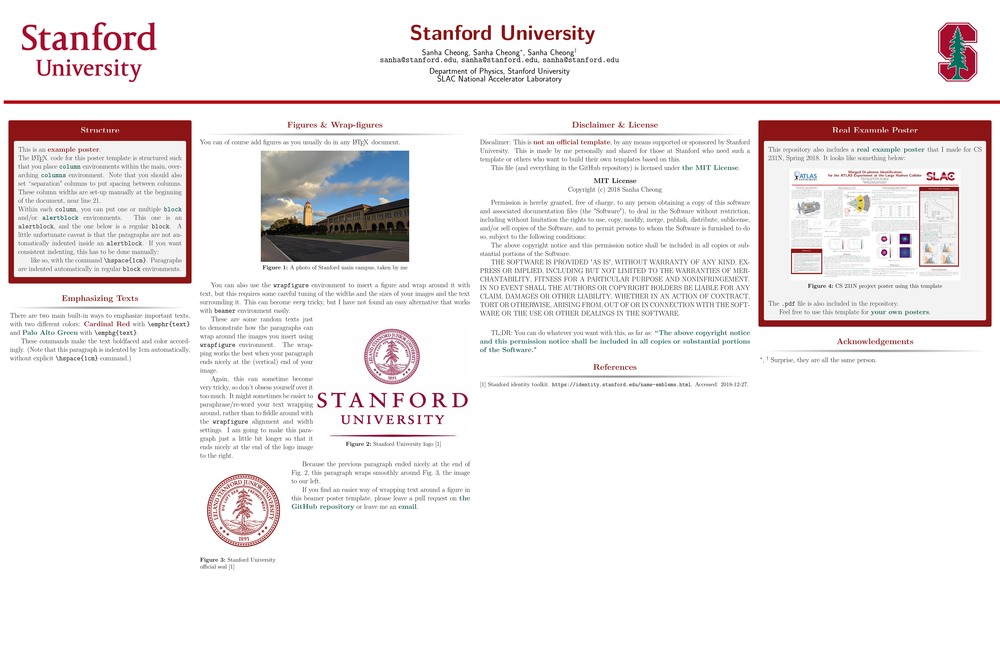

# stanford_beamer_poster
This is an unofficial LaTeX Beamer poster template with Stanford University theme.

Feel free to use this template for your project posters, conference posters, etc.

The repository includes [a simple example file](./example_poster.pdf) (with the [`.tex`](./example_poster.tex) source code) and [a full, example poster](cs231n_project_poster.pdf) that I made for a class project at Stanford(no `.tex` source code provided).

## Example Poster

